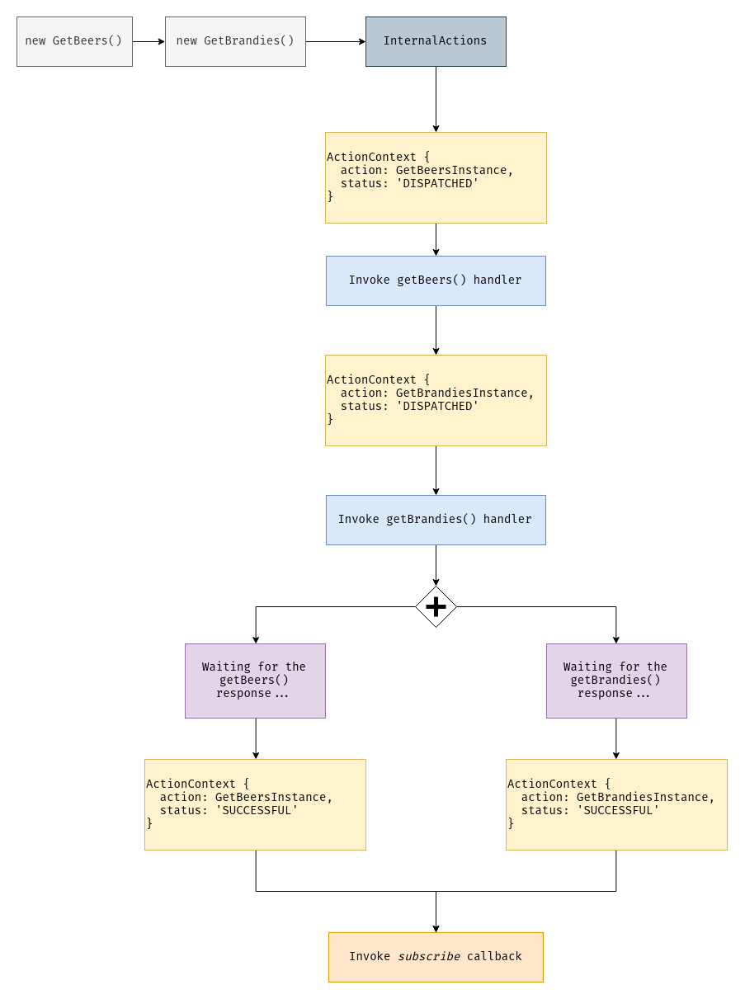

# Action Lifecycle

## Theory

Any action in NGXS can be in one of four states, these states are `DISPATCHED`, `SUCCESSFUL`, `ERRORED`, `CANCELED`.

NGXS has an internal stream of actions. When we dispatch any action using the following code:

```ts
store.dispatch(new GetTickets());
```

The internal actions stream emits an object called `ActionContext`, that has 2 properties:

```ts
{
  action: GetTicketsInstance,
  status: 'DISPATCHED'
}
```

There is an underneath listener that filters actions by `DISPATCHED` status and invokes the appropriate handlers that listen to this action, and then generates a new `ActionContext` with the following `status` value:

```ts
{
  action: GetTicketsInstance,
  status: 'SUCCESSFUL'
}
```

After action is handled "successfully", NGXS creates an observable that's returned by the `dispatch` method so you're able to do anything after all.

If the `GetTickets` handler throws an error, for example:

```ts
@Action(GetTickets)
getTickets() {
  throw new Error('This is just a simple error!');
}
```

Then the following `ActionContext` will be created:

```ts
{
  action: GetTicketsInstance,
  status: 'ERRORED'
}
```

Actions can be both synchronous and asynchronous, for example if you send a request to your API and wait for the response. Asynchronous actions are handled in parallel, synchronous actions are handled one after another.

What about `CANCELED` status? Only asynchronous actions can be canceled, this means that the new action was dispatched before the previous action handler finished doing some asynchronous job. Canceling actions can be achieved by providing options to the `@Action` decorator:

```ts
export class TicketsState {
  constructor(private ticketsService: TicketsService) {}

  @Action(GetTickets, { cancelUncompleted: true })
  getTickets(ctx: StateContext<Ticket[]>) {
    return this.ticketsService.getTickets().pipe(
      tap(tickets => {
        ctx.setState(tickets);
      })
    );
  }
}
```

Imagine a component where you've got a button, that dispatches the `GetTickets` action on click:

```ts
@Component({
  selector: 'app-tickets',
  template: `
    <app-ticket *ngFor="let ticket of tickets$ | async"></app-ticket>
    <button (click)="getTickets()">Get tickets</button>
  `
})
export class TicketsComponent {
  @Select(TicketsState) tickets$: Observable<Ticket[]>;

  constructor(private store: Store) {}

  getTickets() {
    this.store.dispatch(new GetTickets());
  }
}
```

If you click the button twice - two actions will be dispatched and the previous action will be canceled, because it's asynchronous. This works exactly the same as `switchMap`, if we didn't use NGXS - the code would look as follows:

```ts
@Component({
  selector: 'app-tickets',
  template: `
    <app-ticket *ngFor="let ticket of tickets"></app-ticket>
    <button #button>Get tickets</button>
  `
})
export class TicketsComponent implements OnInit {
  @ViewChild('button', { static: true }) button: ElementRef<HTMLButtonElement>;

  tickets: Ticket[] = [];

  constructor(private ticketsService: TicketsService) {}

  ngOnInit() {
    fromEvent(this.button.nativeElement, 'click')
      .pipe(switchMap(() => this.ticketsService.getTickets()))
      .subscribe(tickets => {
        this.tickets = tickets;
      });
  }
}
```

## Asynchronous actions

Let's talk more about asynchronous actions, imagine a simple state that stores liquor and has the following code:

```ts
export interface LiquorStateModel {
  beers: Beer[];
  brandies: Cogniac[];
}

export class GetBeers {
  static type = '[Liquor] Get beers';
}

export class GetBrandies {
  static type = '[Liquor] Get brandies';
}

@State<LiquorStateModel>({
  name: 'liquor',
  defaults: {
    beers: [],
    brandies: []
  }
})
export class LiquorState {
  constructor(private liquorService: LiquorService) {}

  @Action(GetBeers)
  getBeers(ctx: StateContext<LiquorStateModel>) {
    return this.liquorService.getBeers().pipe(
      tap(beers => {
        ctx.patchState({ beers });
      })
    );
  }

  @Action(GetBrandies)
  getBrandies(ctx: StateContext<LiquorStateModel>) {
    return this.liquorService.getBrandies().pipe(
      tap(brandies => {
        ctx.patchState({ brandies });
      })
    );
  }
}
```

If you dispatch `GetBeers` and `GetBrandies` actions separately, like:

```ts
store
  .dispatch(new GetBeers())
  .subscribe(() => {
    ...
  });

store
  .dispatch(new GetBrandies())
  .subscribe(() => {
    ...
  });
```

As their action handlers are asynchronous - you can't be sure what HTTP response will come first. In that example we dispatch the `GetBeers` action before `GetBrandies`, but if there were problems on the server side and the server returned a response after 5 seconds, then the `beers` property will be set after `brandies`.

You can dispatch an array of actions:

```ts
store
  .dispatch([
    new GetBeers(),
    new GetBrandies()
  ])
  .subscribe(() => {
    ...
  });
```

We don't care what response will be handled first, but we're sure that we will do an extra work after we receive our `beers` and `brandies`. The below diagram demonstrates how asynchronous actions are handled under the hood:



In summary
