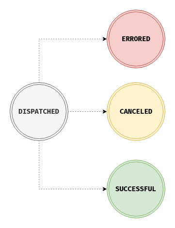
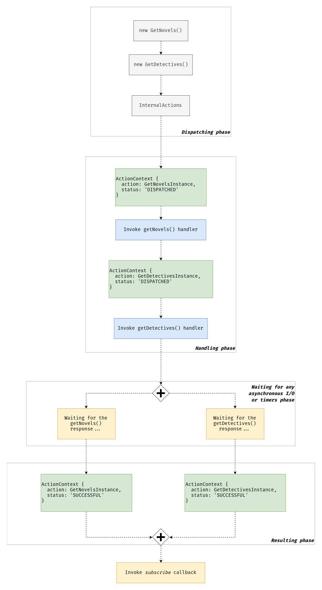

# Actions Life Cycle

This document describes the life cycle of actions, after reading it you should have a better understanding of how NGXS handles actions and what stages they may be at.

## Theory

Any action in NGXS can be in one of four states, these states are `DISPATCHED`, `SUCCESSFUL`, `ERRORED`, `CANCELED`, think of it as a finite state machine.



NGXS has an internal stream of actions. When we dispatch any action using the following code:

```ts
store.dispatch(new GetNovels());
```

The internal actions stream emits an object called `ActionContext`, that has 2 properties:

```ts
{
  action: GetNovelsInstance,
  status: 'DISPATCHED'
}
```

There is an action stream listener that filters actions by `DISPATCHED` status and invokes the appropriate handlers for this action. After all processing for the action has completed it generates a new `ActionContext` with the following `status` value:

```ts
{
  action: GetNovelsInstance,
  status: 'SUCCESSFUL'
}
```

The observable returned by the `dispatch` method is then triggered after the action is handled "successfully" and, in response to this observable, you are able to do the actions you wanted to do on completion of the action.

If the `GetNovels` handler throws an error, for example:

```ts
@Action(GetNovels)
getNovels() {
  throw new Error('This is just a simple error!');
}
```

Then the following `ActionContext` will be created:

```ts
{
  action: GetNovelsInstance,
  status: 'ERRORED'
}
```

Actions can be both synchronous and asynchronous, for example if you send a request to your API and wait for the response. Asynchronous actions are handled in parallel, synchronous actions are handled one after another.

What about the `CANCELED` status? Only asynchronous actions can be canceled, this means that the new action was dispatched before the previous action handler finished doing some asynchronous job. Canceling actions can be achieved by providing options to the `@Action` decorator:

```ts
export class NovelsState {
  constructor(private novelsService: NovelsService) {}

  @Action(GetNovels, { cancelUncompleted: true })
  getNovels(ctx: StateContext<Novel[]>) {
    return this.novelsService.getNovels().pipe(
      tap(novels => {
        ctx.setState(novels);
      })
    );
  }
}
```

Imagine a component where you've got a button that dispatches the `GetNovels` action on click:

```ts
@Component({
  selector: 'app-novels',
  template: `
    <app-novel *ngFor="let novel of novels$ | async" [novel]="novel"></app-novel>
    <button (click)="getNovels()">Get novels</button>
  `
})
export class NovelsComponent {
  @Select(NovelsState) novels$: Observable<Novel[]>;

  constructor(private store: Store) {}

  getNovels() {
    this.store.dispatch(new GetNovels());
  }
}
```

If you click the button twice - two actions will be dispatched and the previous action will be canceled because it's asynchronous. This works exactly the same as `switchMap`. If we didn't use NGXS - the code would look as follows:

```ts
@Component({
  selector: 'app-novels',
  template: `
    <app-novel *ngFor="let novel of novels" [novel]="novel"></app-novel>
    <button #button>Get novels</button>
  `
})
export class NovelsComponent implements OnInit {
  @ViewChild('button', { static: true }) button: ElementRef<HTMLButtonElement>;

  novels: Novel[] = [];

  constructor(private novelsService: NovelsService) {}

  ngOnInit() {
    fromEvent(this.button.nativeElement, 'click')
      .pipe(switchMap(() => this.novelsService.getNovels()))
      .subscribe(novels => {
        this.novels = novels;
      });
  }
}
```

## Asynchronous actions

Let's talk more about asynchronous actions, imagine a simple state that stores different genres of books and has the following code:

```ts
export interface BooksStateModel {
  novels: Book[];
  detectives: Book[];
}

export class GetNovels {
  static type = '[Books] Get novels';
}

export class GetDetectives {
  static type = '[Books] Get detectives';
}

@State<BooksStateModel>({
  name: 'books',
  defaults: {
    novels: [],
    detectives: []
  }
})
export class BooksState {
  constructor(private booksService: BooksService) {}

  @Action(GetNovels)
  getNovels(ctx: StateContext<BooksStateModel>) {
    return this.booksService.getNovels().pipe(
      tap(novels => {
        ctx.patchState({ novels });
      })
    );
  }

  @Action(GetDetectives)
  getDetectives(ctx: StateContext<BooksStateModel>) {
    return this.booksService.getDetectives().pipe(
      tap(detectives => {
        ctx.patchState({ detectives });
      })
    );
  }
}
```

Let's say that you dispatch `GetNovels` and `GetDetectives` actions separately like this:

```ts
store
  .dispatch(new GetNovels())
  .subscribe(() => {
    ...
  });

store
  .dispatch(new GetDetectives())
  .subscribe(() => {
    ...
  });
```

You could correctly assume that the request for `GetNovels` would be dispatched before `GetDetectives`. This is true due to the synchronous nature of the dispatch, but their action handlers are asynchronous so you can't be sure which HTTP response would return first. In this example we dispatch the `GetNovels` action before `GetDetectives`, but if the call to fetch novels takes longer then the `novels` property will be set after `detectives`. The `store.dispatch` function returns an observable that can be used to respond to the completion of each of these actions.

Alternatively you could dispatch an array of actions:

```ts
store
  .dispatch([
    new GetNovels(),
    new GetDetectives()
  ])
  .subscribe(() => {
    ...
  });
```

The order of dispatch would be the same as the previous example, but in this code we are able to subscribe to an observable from the `store.dispatch` function that will fire only when both actions have completed. The below diagram demonstrates how asynchronous actions are handled under the hood:



## Error life cycle

So, how are errors handled in this regard? Let's say that you dispatch multiple actions at the same time like this:

```ts
store
  .dispatch([
    new GetNovelById(id), // action handler throws `new Error(...)`
    new GetDetectiveById(id)
  ])
  .subscribe(
    () => {
      // they will never see me
    },
    error => {
      console.log(error); // `Error` that was thrown by the `getNovelById` handler
    }
  );
```

Because at least one action throws an error NGXS returns an error to the `onError` observable callback and neither the `onNext` or `onComplete` callbacks would be called.


## Asynchronous Actions continued - "Fire and forget" vs "Fire and wait"

In NGXS, when you do asynchronous work you should return an `Observable` or `Promise` from your `@Action` method that represents that asynchronous work (and completion). The completion of the action will then be bound to the completion of the asynchronous work. If you use the `async/await` javascript syntax then NGXS will know about the completion because an `async` method returns the `Promise` for you. If you return an `Observable` NGXS will subscribe to the observable for you and bind the action's completion lifecycle event to the completion of the `Observable`.

Sometimes you may not want the completion of an action to wait for the asynchronous work to complete. This is what we will refer to as "fire and forget". This can be achieved by simply not returning the handle to your asynchronous work from the `@Action` method. Note that in the case of an `Observable` you would have to `.subscribe(...)` or call `.toPromise()` to ensure that your observable runs.

`Observable` version:

```ts
@Action(GetNovels)
getNovels(ctx: StateContext<BooksStateModel>) {
  this.booksService.getNovels().subscribe(novels => {
    ctx.patchState({ novels });
  });
}
```

`Promise` version:

```ts
@Action(GetNovels)
getNovels(ctx: StateContext<BooksStateModel>) {
  this.booksService.getNovels().toPromise()
    .then(novels => {
      ctx.patchState({ novels });
    });
}
```

Another more common use case of using the "fire and forget" approach would be when you dispatch a new action inside a handler and you don't want to wait for the 'child' action to complete. For example, if we want to load detectives right after novels but we don't want the completion of our `GetNovels` action to wait for the detectives to load then we would have the following code:

```ts
export class BooksState {
  constructor(private booksService: BooksService) {}

  @Action(GetNovels)
  getNovels(ctx: StateContext<BooksStateModel>) {
    return this.booksService.getNovels().pipe(
      tap(novels => {
        ctx.patchState({ novels });
        ctx.dispatch(new GetDetectives());
      })
    );
  }

  @Action(GetDetectives)
  getDetectives(ctx: StateContext<BooksStateModel>) {
    return this.booksService.getDetectives().pipe(
      tap(detectives => {
        ctx.patchState({ detectives });
      })
    );
  }
}
```

Here the `GetDetectives` action would be dispatched just before the `GetNovels` action completes. The `GetDetectives` action is just a "fire and forget" as far as the `GetNovels` action is concerned. To be clear, NGXS will wait for a response from the `getNovels` service call, then it will populate a new state with the returned novels, then it will dispatch the new `GetDetectives` action (which kicks off another asynchronous request), and then `GetNovels` would move into its' success state (without waiting for the completion of the `GetDetectives` action):

```ts
store
  .dispatch(new GetNovels())
  .subscribe(() => {
    // they will see me, but detectives will be still loading in the background
  });
```

If you want the `GetNovels` action to wait for the `GetDetectives` action to complete, you will have to use `mergeMap` operator (or any operator that maps to the inner `Observable`, like `concatMap`, `switchMap`, `exhaustMap`) so that the `Observable` returned by the `@Action` method has bound its completion to the inner action's completion:

```ts
@Action(GetNovels)
getNovels(ctx: StateContext<BooksStateModel>) {
  return this.booksService.getNovels().pipe(
    tap(novels => {
      ctx.patchState({ novels });
    }),
    mergeMap(() => ctx.dispatch(new GetDetectives()))
  );
}
```
Often this type of code can be made simpler by converting to Promises and using the `async/await` syntax. The same method would be as follows:
```ts
@Action(GetNovels)
async getNovels(ctx: StateContext<BooksStateModel>) {
  const novels = await this.booksService.getNovels().toPromise();
  ctx.patchState({ novels });
  await ctx.dispatch(new GetDetectives()).toPromise();
}
```
Note: leaving out the final `await` keyword here would cause this to be "fire and forget" again.

## Summary

In summary - any dispatched action starts with the status `DISPATCHED`. Next, NGXS looks for handlers that listen to this action, if there are any — NGXS invokes them and processes the return value and errors. If the handler has done some work and has not thrown an error, the status of the action changes to `SUCCESSFUL`. If something went wrong while processing the action (for example, if the server returned an error) then the status of the action changes to `ERRORED`. And if an action handler is marked as `cancelUncompleted` and a new action has arrived before the old one was processed then NGXS interrupts the processing of the first action and sets the action status to `CANCELED`.
