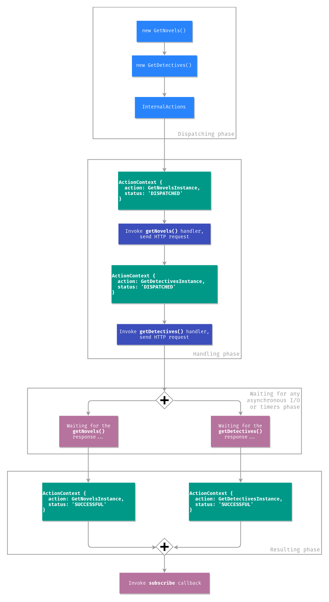

# Actions Life Cycle

This document describes the life cycle of actions, after reading it you will understand how the NGXS handles actions and what stages they may be at.

## Theory

Any action in NGXS can be in one of four states, these states are `DISPATCHED`, `SUCCESSFUL`, `ERRORED`, `CANCELED`, think of it as a finite state machine.


NGXS has an internal stream of actions. When we dispatch any action using the following code:

```ts
store.dispatch(new GetNovels());
```

The internal actions stream emits an object called `ActionContext`, that has 2 properties:

```ts
{
  action: GetNovelsInstance,
  status: 'DISPATCHED'
}
```

There is an action stream listener that filters actions by `DISPATCHED` status and invokes the appropriate handlers for this action. After all processing for the action has completed it generates a new `ActionContext` with the following `status` value:

```ts
{
  action: GetNovelsInstance,
  status: 'SUCCESSFUL'
}
```

The observable returned by the `dispatch` method is then triggered after the action is handled "successfully" and, in response to this observable, you are able to do the actions you wanted to do on completion of the action.

If the `GetNovels` handler throws an error, for example:

```ts
@Action(GetNovels)
getNovels() {
  throw new Error('This is just a simple error!');
}
```

Then the following `ActionContext` will be created:

```ts
{
  action: GetNovelsInstance,
  status: 'ERRORED'
}
```

Actions can be both synchronous and asynchronous, for example if you send a request to your API and wait for the response. Asynchronous actions are handled in parallel, synchronous actions are handled one after another.

What about the `CANCELED` status? Only asynchronous actions can be canceled, this means that the new action was dispatched before the previous action handler finished doing some asynchronous job. Canceling actions can be achieved by providing options to the `@Action` decorator:

```ts
export class NovelsState {
  constructor(private novelsService: NovelsService) {}

  @Action(GetNovels, { cancelUncompleted: true })
  getNovels(ctx: StateContext<Novel[]>) {
    return this.novelsService.getNovels().pipe(
      tap(novels => {
        ctx.setState(novels);
      })
    );
  }
}
```

Imagine a component where you've got a button that dispatches the `GetNovels` action on click:

```ts
@Component({
  selector: 'app-novels',
  template: `
    <app-novel *ngFor="let novel of novels$ | async" [novel]="novel"></app-novel>
    <button (click)="getNovels()">Get novels</button>
  `
})
export class NovelsComponent {
  @Select(NovelsState) novels$: Observable<Novel[]>;

  constructor(private store: Store) {}

  getNovels() {
    this.store.dispatch(new GetNovels());
  }
}
```

If you click the button twice - two actions will be dispatched and the previous action will be canceled because it's asynchronous. This works exactly the same as `switchMap`. If we didn't use NGXS - the code would look as follows:

```ts
@Component({
  selector: 'app-novels',
  template: `
    <app-novel *ngFor="let novel of novels" [novel]="novel"></app-novel>
    <button #button>Get novels</button>
  `
})
export class NovelsComponent implements OnInit {
  @ViewChild('button', { static: true }) button: ElementRef<HTMLButtonElement>;

  novels: Novel[] = [];

  constructor(private novelsService: NovelsService) {}

  ngOnInit() {
    fromEvent(this.button.nativeElement, 'click')
      .pipe(switchMap(() => this.novelsService.getNovels()))
      .subscribe(novels => {
        this.novels = novels;
      });
  }
}
```

## Asynchronous actions

Let's talk more about asynchronous actions, imagine a simple state that stores different genres of books and has the following code:

```ts
export interface BooksStateModel {
  novels: Book[];
  detectives: Book[];
}

export class GetNovels {
  static type = '[Books] Get novels';
}

export class GetDetectives {
  static type = '[Books] Get detectives';
}

@State<BooksStateModel>({
  name: 'books',
  defaults: {
    novels: [],
    detectives: []
  }
})
export class BooksState {
  constructor(private booksService: BooksService) {}

  @Action(GetNovels)
  getNovels(ctx: StateContext<BooksStateModel>) {
    return this.booksService.getNovels().pipe(
      tap(novels => {
        ctx.patchState({ novels });
      })
    );
  }

  @Action(GetDetectives)
  getDetectives(ctx: StateContext<BooksStateModel>) {
    return this.booksService.getDetectives().pipe(
      tap(detectives => {
        ctx.patchState({ detectives });
      })
    );
  }
}
```

If you dispatch `GetNovels` and `GetDetectives` actions separately, like:

```ts
store
  .dispatch(new GetNovels())
  .subscribe(() => {
    ...
  });

store
  .dispatch(new GetDetectives())
  .subscribe(() => {
    ...
  });
```

As their action handlers are asynchronous - you can't be sure what HTTP response will come first. In that example we dispatch the `GetNovels` action before `GetDetectives`, but if there were problems on the server side and the server returned a response after 5 seconds, then the `novels` property will be set after `detectives`.

You can dispatch an array of actions:

```ts
store
  .dispatch([
    new GetNovels(),
    new GetDetectives()
  ])
  .subscribe(() => {
    ...
  });
```

We don't care what response will be handled first, but we're sure that we will do an extra work after we receive our `novels` and `detectives`. The below diagram demonstrates how asynchronous actions are handled under the hood:



## Error life cycle

If you dispatch multiple actions at the same time, for example:

```ts
store
  .dispatch([
    new GetNovelById(id),
    new GetDetectiveById(id)
  ])
  .subscribe(() => {
    ...
  });
```

NGXS will abort and return an error to the `onError` callback if at least one action handler throws an exception:

```ts
store
  .dispatch([
    new GetNovelById(id), // action handler throws `new Error(...)`
    new GetDetectiveById(id)
  ])
  .subscribe(
    () => {
      // they will never see me
    },
    error => {
      console.log(error); // `Error` that throwed `getNovelById` handler
    }
  );
```

## Fire and forget

It is also possible not to wait for the completion of some asynchronous operation, this is called "fire and forget". When you return an `Observable` or `Promise` - the NGXS will wait for all asynchronous work to complete. You also can do the subscription inside the action handler and the success doesn't wait for the async work to complete.

`Observable` version:

```ts
@Action(GetNovels)
getNovels(ctx: StateContext<BooksStateModel>) {
  this.booksService.getNovels().subscribe(novels => {
    ctx.patchState({ novels });
  });
}
```

`Promise` version:

```ts
@Action(GetNovels)
getNovels(ctx: StateContext<BooksStateModel>) {
  this.booksService
    .getNovels()
    .toPromise()
    .then(novels => {
      ctx.patchState({ novels });
    });
}
```

The use case of using the "fire and forget" approach can be dispatching a new action inside a handler, without waiting for it to complete. For example we want to load detective right after novels, but we don't want to wait for it to finish:

```ts
export class BooksState {
  constructor(private booksService: BooksService) {}

  @Action(GetNovels)
  getNovels(ctx: StateContext<BooksStateModel>) {
    return this.booksService.getNovels().pipe(
      tap(novels => {
        ctx.patchState({ novels });
        ctx.dispatch(new GetDetectives());
      })
    );
  }

  @Action(GetDetectives)
  getDetectives(ctx: StateContext<BooksStateModel>) {
    return this.booksService.getDetectives().pipe(
      tap(detectives => {
        ctx.patchState({ detectives });
      })
    );
  }
}
```

NGXS will wait for a response from the `getNovels`, after this, it will populate a new state and dispatch a new action, but will not wait for completion of the `GetDetectives`:

```ts
store
  .dispatch(new GetNovels())
  .subscribe(() => {
    // they will see me, but detectives will be still loading in the background
  });
```

If you want NGXS to wait for the `GetDetectives` action to complete, you've got to use `mergeMap` (or any operator that maps to the inner `Observable`, like `concatMap`, `switchMap`, `exhaustMap`):

```ts
@Action(GetNovels)
getNovels(ctx: StateContext<BooksStateModel>) {
  return this.booksService.getNovels().pipe(
    tap(novels => {
      ctx.patchState({ novels });
    }),
    mergeMap(() => ctx.dispatch(new GetDetectives()))
  );
}
```

Notice that `async/await` is not "fire and forget", since the method marked with the keyword `async` returns the `Promise` by default, so the NGXS will wait for its resolution.

In summary - any dispatched action starts with the status `DISPATCHED`. Next, NGXS looks for handlers that listen to this action, if there are any — NGXS invokes them and processes the return value and errors. If the handler has done some work and has not thrown an error the status of the action changes to `SUCCESSFUL`. If something went wrong while processing the action (for example, if the server returned an error) the status of the action changes to `ERRORED`. If an action handler is marked as `cancelUncompleted` and a new action has arrived before the old one was processed then NGXS interrupts the processing of the first action and changes the action status to `CANCELED`.
