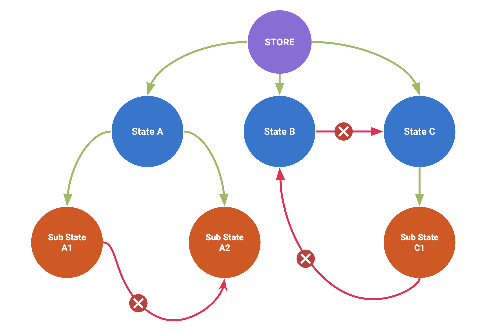

# Sub Stores

Complex and large state graphs are difficult to manage. Oftentimes we need
to break these down into sub states that we can manage on a individual
basis. With NGXS, we can use a concept called sub states to handle this.

## Unidirectional Data Flow in NGXS

Unidirectional data flow as a pattern is usually mentioned when talking about performance in Angular. The reason why data flows from top to bottom, is because change detection is also always performed from top to bottom for every single component, every single time, starting from the root component. Unidirectional data flow is much easier to debug as it has no side effects unlike the AngularJS's digest cycle. The view is stable throughout a single rendering pass.

Unidirectional data flow policy is also applied to the state management. We have to make sure that states are independent and do not affect each other, the child state should know nothing about its parent. Potentially that could lead to unpredictable side effects. Our states are meant to be encapsulated from each other and only the parent can manage its children.



## Example

Let's take the following example state graph:

```TS
{
  cart: {
    checkedout: false,
    items: [],
    saved: {
      dateSaved: new Date(),
      items: []
    };
  }
}
```

At the top, we have a `cart` with several items associated to its state.
Beneath that we have a `saved` object which represents another state slice.
To express this relationship with NGXS, we simply need to use the `children`
property in the `@State` decorator:

```TS
export interface CartStateModel {
  checkedout: boolean;
  items: CartItem[];
}

@State<CartStateModel>({
  name: 'cart',
  defaults: {
    checkedout: false,
    items: []
  },
  children: [CartSavedState]
})
export class CartState {}
```

Then we describe our substate like normal:

```TS
export interface CartSavedStateModel {
  dateSaved: Date;
  items: CartItem[];
}

@State<CartSavedStateModel>({
  name: 'saved',
  defaults: {
    dateSaved: new Date(),
    items: []
  }
})
export class CartSavedState {}
```

The relationship between these two are bound by their hierarchical order. To finish this up, we need to import both of these into the `NgxsModule`:

```TS
@NgModule({
  imports: [
    NgxsModule.forRoot([
      CartState,
      CartSavedState
    ])
  ]
})
export class AppModule {}
```

The store will then automatically recognize the relationship and bind them together.

## Caveats

This is only intended to work with nested objects, so trying to create stores on
nested array objects will not work.

Sub states can only be used once, reuse implies several restrictions that would eliminate
some high value features. If you want to re-use them, just create a new state and inherit
from it.

## Preventing sub-state erasure

Let's have a look at the state graph again:

```TS
{
  cart: {
    checkedout: false,
    items: [],
    saved: {
      dateSaved: new Date(),
      items: []
    };
  }
}
```

This means that you have to avoid using `setState` function in the parent `CartState` state as your child state will erase. Assume you've got an action called `SetCheckedoutAndItems`:

```TS
export interface CartStateModel {
  checkedout: boolean;
  items: CartItem[];
}

export class SetCheckedoutAndItems {
  static type = '[Cart] Set checkedout and items';
  constructor(public checkedout: boolean, public items: CartItem[]) {}
}

@State<CartStateModel>({
  name: 'cart',
  defaults: {
    checkedout: false,
    items: []
  },
  children: [CartSavedState]
})
export class CartState {
  @Action(SetCheckedoutAndItems)
  setCheckedoutAndItems(ctx: StateContext<CartStateModel>, { checkedout, items }: SetCheckedoutAndItems) {
    ctx.patchState({ checkedout, items });
  }
}
```

If we had used the `setState` function - we would have overwritten the whole state value and our sub-state `CartSavedState` would be erased. The `patchState` function allows us to update only needed properties and preserve our sub-state safe and sound.
