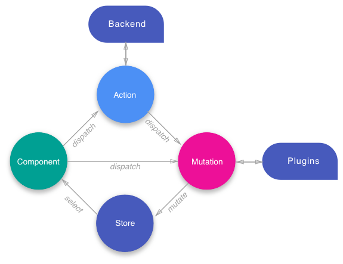

## Concepts
There are 4 major concepts to NGXS:

- Store: Global state container, action dispatcher and selector
- Actions: Class describing the action to take and its payload
- State: Class definition of the state
- Selects: State slice selectors

These concepts create a circular control flow traveling from a component
dispatching an action, to a store reacting to the action, back to the component
through a state select.

  

