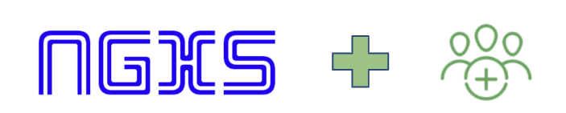

   

We announced a new idea called [NGXS Labs](https://github.com/ngxs-labs). The goal of NGXS Labs is to more clearly communicate the balance between new explorations by the team, with the normal stability that our community has come to expect since the release of NGXS.

### Introduction

There is definitely no lack of enthusiasm for the NGXS project and as a result there has been a proliferation of pull requests to add new features to the framework. This is very exciting but at the same time has been one of the big challenges. How do we incorporate the growing innovation around the framework and experiment with different ideas without compromising the stability and comprehensibility of the core framework? In response to this we have created NGXS Labs.

The idea with this github organisation is to provide a place for the community to create libraries that augment the main framework with functionality that does not need to be integrated directly into the framework and therefore can evolve through their initial iterations of experimentation without affecting the main `@ngxs/store` library. Once a project in the labs space has stabilised, has received significant adoption and is accepted as a recommended approach then it can be moved to the ngxs github organisation.

From time to time we will be posting about projects that have been started under the ngxs-labs organisation to get community involvement and feedback around them.

### Labs Packages

<table>
  <tr>
    <th>Package</th>
    <th>Version</th>
    <th>Status</th>
  </tr>
  <tr>
    <td><a href="https://npmjs.com/package/@ngxs-labs/emitter">@ngxs-labs/emitter</a></td>
    <td></td>
    <td>Stable</td>
  </tr>
  <tr>
    <td><a href="https://npmjs.com/package/@ngxs-labs/immer-adapter">@ngxs-labs/immer-adapter</a></td>
    <td></td>
    <td>Stable</td>
  </tr>
  <tr>
    <td><a href="https://npmjs.com/package/@ngxs-labs/dispatch-decorator">@ngxs-labs/dispatch-decorator</a></td>
    <td></td>
    <td>Stable</td>
  </tr>
  <tr>
    <td><a href="https://npmjs.com/package/@ngxs-labs/async-storage-plugin">@ngxs-labs/async-storage-plugin</a></td>
    <td></td>
    <td>Alpha</td>
  </tr>
  <tr>
    <td><a href="https://npmjs.com/package/@ngxs-labs/entity-state">@ngxs-labs/entity-state</a></td>
    <td></td>
    <td>Development</td>
  </tr>
</table>
