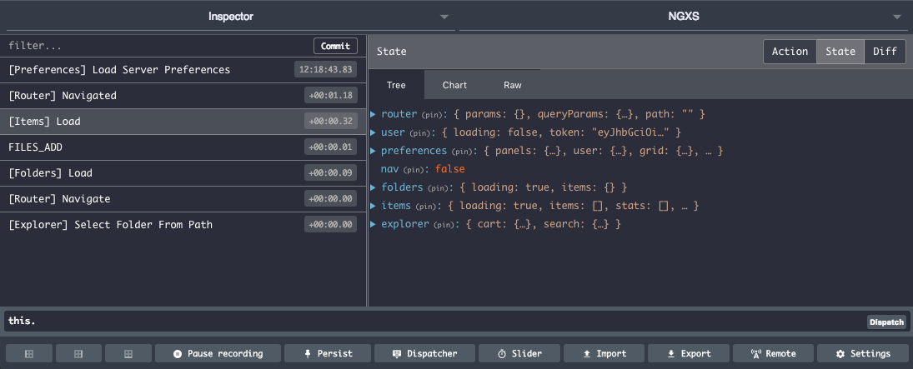

# Redux Devtools

Reference: [Redux Devtools](https://github.com/reduxjs/redux-devtools/tree/master/extension)

Plugin with integration:

- [Chrome - Redux Devtools](https://chrome.google.com/webstore/detail/redux-devtools/lmhkpmbekcpmknklioeibfkpmmfibljd)
- [Firefox - Redux Devtools](https://addons.mozilla.org/en-US/firefox/addon/reduxdevtools/)




## Installation

```bash
npm install @ngxs/devtools-plugin --save-dev

# or if you are using yarn
yarn add @ngxs/devtools-plugin --dev
```

## Usage

Add the `NgxsReduxDevtoolsPluginModule` plugin to your root app module:

```ts
import { NgxsModule } from '@ngxs/store';
import { NgxsReduxDevtoolsPluginModule } from '@ngxs/devtools-plugin';

@NgModule({
  imports: [NgxsModule.forRoot([]), NgxsReduxDevtoolsPluginModule.forRoot()]
})
export class AppModule {}
```

### Options

The plugin supports the following options passed via the `forRoot` method:

- `name`: Set the name by which this store instance is referenced in devtools (Default: 'NGXS')
- `disabled`: Disable the devtools during production
- `maxAge`: Max number of entries to keep.
- `actionSanitizer`: Reformat actions before sending to dev tools
- `stateSanitizer`: Reformat state before sending to devtools

### Notes

You should always include the devtools as the last plugin in your configuration.
For instance, if you were to include devtools before a plugin like the storage
plugin, the initial state would not be reflected.
