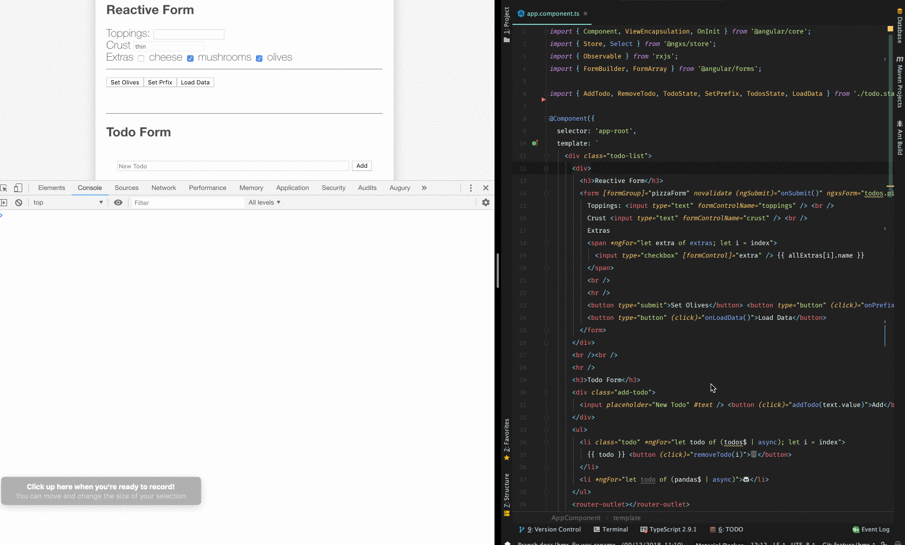

# Hot Module Replacement

Hot Module Replacement (HMR) is a Webpack feature to update code in a running app without rebuilding it. This results in faster updates and less full page-reloads.
In order to get HMR working with Angular CLI we first need to add a new environment and enable it.

### Add environment for HMR

In this step we will configure the Angular CLI environments and define in which environment we enable HMR.
We will start out by adding and changing files in the `src/environments/` directory.
First we create a file called `src/environments/environment.hmr.ts` with the following contents:

```ts
export const environment = {
  production: false,
  hmr: true
};
```

Update `src/environments/environment.prod.ts` and add the hmr: false flag to the environment:

```ts
export const environment = {
  production: true,
  hmr: false
};
```

Lastly we edit `src/environments/environment.ts` and change the environment to:

```ts
export const environment = {
  production: false,
  hmr: false
};
```

Update angular.json to include an hmr environment as explained here and add configurations within build and serve to enable hmr.
Note that <project-name> here represents the name of the project you are adding this configuration to in angular.json.

```text
  "build": {
    "configurations": {
      ...
      "hmr": {
        "fileReplacements": [
          {
            "replace": "src/environments/environment.ts",
            "with": "src/environments/environment.hmr.ts"
          }
        ]
      }
    }
  },
  ...
  "serve": {
    "configurations": {
      ...
      "hmr": {
        "hmr": true,
        "browserTarget": "<project-name>:build:hmr"
      }
    }
  }
```

Add the necessary types to src/tsconfig.app.json

```text
{
  ...
  "compilerOptions": {
    ...
    "types": ["node"]
  },
}
```

Run ng serve with the flag --configuration hmr to enable hmr and select the new environment:

```bash
ng serve --configuration hmr
```

Create a shortcut for this by updating package.json and adding an entry to the script object:

```bash
"scripts": {
  ...
  "hmr": "ng serve --configuration hmr"
}
```

### Add dependency and configure app

In order to get HMR working we need to install the dependency and configure our app to use it.

Install the `@ngxs/hmr-plugin` package as a dev-dependency

Update src/main.ts to use the file we just created:

```ts
import { platformBrowserDynamic } from '@angular/platform-browser-dynamic';
import { enableProdMode, NgModuleRef } from '@angular/core';

import { AppModule } from './app/app.module';
import { environment } from './environments/environment';

if (environment.production) {
  enableProdMode();
}

const bootstrap = () => platformBrowserDynamic().bootstrapModule(AppModule);

if (environment.hmr) {
  import('@ngxs/hmr-plugin').then(plugin => {
    plugin.hmr(module, bootstrap).catch((err: Error) => console.error(err))
  });
} else {
  bootstrap().catch((err: Error) => console.log(err));
}
```

The `@ngxs/hmr-plugin` should be loaded on demand using dynamic import thus this can benefit more readily from tree shaking.

### (OPTIONAL) Update src/app/app.module.ts to manage the state in HMR lifecycle:

```ts
import { StateContext } from '@ngxs/store';
import { NgxsHmrLifeCycle, NgxsHmrSnapshot as Snapshot } from '@ngxs/hmr-plugin';

@NgModule({ .. })
export class AppBrowserModule implements NgxsHmrLifeCycle<Snapshot> {
  public hmrNgxsStoreOnInit(ctx: StateContext<Snapshot>, snapshot: Partial<Snapshot>) {
    ctx.patchState(snapshot);
  }

  public hmrNgxsStoreBeforeOnDestroy(ctx: StateContext<Snapshot>): Partial<Snapshot> {
    return ctx.getState();
  }
}
```

### Starting the development environment with HMR enabled

Now that everything is set up we can run the new configuration:

```bash
npm run hmr
```

Example:



When starting the server Webpack will tell you that it’s enabled:

```bash
NOTICE Hot Module Replacement (HMR) is enabled for the dev server.
```

Now if you make changes to one of your components, those changes should be visible automatically without a complete browser refresh.

### HMR lifecycle

If you want to do some modifications to the state during the hmr lifecycle you can use these built-in actions. They will not be executed in production.

```ts
import { HmrInitAction, HmrBeforeDestroyAction } from '@ngxs/hmr-plugin';

@State({ ... })
export class MyState {
  @Action(HmrInitAction)
  public hmrInit(ctx: StateContext, { payload }) {
    ctx.setState({ ... })
  }

  @Action(HmrBeforeDestroyAction)
  public hrmBeforeDestroy(ctx: StateContext, { payload }) {
    ctx.setState({ ... })
  }
}
```
