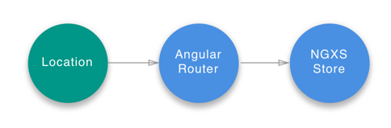

# Router Plugin



In the browser, the location (URL information) and session history
(a stack of locations visited by the current browser tab) are stored in the
global window object. They are accessible via:

- `window.location` ([Location API](https://developer.mozilla.org/en-US/docs/Web/API/Location))
- `window.history` ([History API](https://developer.mozilla.org/en-US/docs/Web/API/History))

Our location data is a dynamic and important part of application state-the kind
of state that belongs in a store. Holding it in the store enables devtools luxuries like
time-travel debugging, and easy access from any store-connected component.

This plugin binds that state from the Angular router to our NGXS store.

## Installation
```bash
npm install @ngxs/router-plugin --save

# or if you are using yarn
yarn add @ngxs/router-plugin
```

## Usage
Add the `NgxsRouterPluginModule` plugin to your root app module:

```TS
import { NgxsModule } from '@ngxs/store';
import { NgxsRouterPluginModule } from '@ngxs/router-plugin';

@NgModule({
  imports: [
    NgxsModule.forRoot([]),
    NgxsRouterPluginModule.forRoot()
  ]
})
export class AppModule {}
```

Now the route will be reflected in your store under the `router` state name. The
state is represented as a `RouterStateSnapshot` object.

You can also navigate using the store's dispatch method. It accepts the following
arguments: `new Navigate(path: any[], queryParams?: Params, extras?: NavigationExtras)`.
A simple example would be navigating to the admin page like this:

```TS
import { Store } from '@ngxs/store';
import { Navigate } from '@ngxs/router-plugin';

@Component({ ... })
export class MyApp {

  constructor(private store: Store) {}

  onClick() {
    this.store.dispatch(new Navigate(['/admin']))
  }

}
```

You can use action handlers to listen to state changes in your components
and services by subscribing to the `RouterNavigation`, `RouterCancel`, `RouterError` or `RouterDataResolved`
action classes.

## Listening to the data resolution event
You can listen to the `RouterDataResolved` action that is dispatch when the navigated route has some linked resolvers. For example:

```TS
import { Actions, ofActionSuccessful } from '@ngxs/store';
import { RouterDataResolved } from '@ngxs/router-plugin';

import { Subject } from 'rxjs';
import { takeUntil } from 'rxjs/operators';

@Component({ ... })
export class AppComponent {

  private destroy$ = new Subject<void>();

  constructor(actions$: Actions) {
    actions$.pipe(
      ofActionSuccessful(RouterDataResolved),
      takeUntil(this.destroy$)
    ).subscribe((action: RouterDataResolved) => {
      console.log(action.routerState.root.firstChild.data);
    });
  }

  ngOnDestroy(): void {
    this.destroy$.next();
    this.destroy$.complete();
  }

}
```

The more explicit example would be a situation where you would want to bind an input property providing some resolved data. For example:

```TS
import { Actions, ofActionSuccessful } from '@ngxs/store';
import { RouterDataResolved } from '@ngxs/router-plugin';

import { map } from 'rxjs/operators';

@Component({
  template: `
    <app-some-component [data]="data$ | async"></app-some-component>
  `
})
export class AppComponent {

  data$ = this.actions$.pipe(
    ofActionSuccessful(RouterDataResolved),
    map((action: RouterDataResolved) => action.routerState.root.firstChild.data)
  );

  constructor(private actions$: Actions) {}

}
```

## Custom Router State Serializer
You can implement your own router state serializer to serialize the router snapshot.

```TS
import { Params, RouterStateSnapshot } from '@angular/router';

import { NgxsModule } from '@ngxs/store';
import { NgxsRouterPluginModule, RouterStateSerializer } from '@ngxs/router-plugin';

export interface RouterStateParams {
  url: string;
  params: Params;
  queryParams: Params;
}

// Map the router snapshot to { url, params, queryParams }
export class CustomRouterStateSerializer implements RouterStateSerializer<RouterStateParams> {
  serialize(routerState: RouterStateSnapshot): RouterStateParams {
    const {
      url,
      root: { queryParams }
    } = routerState;

    let { root: route } = routerState;
    while (route.firstChild) {
      route = route.firstChild;
    }

    const { params } = route;

    return { url, params, queryParams };
  }
}

@NgModule({
  imports: [NgxsModule.forRoot([]), NgxsRouterPluginModule.forRoot()],
  providers: [{ provide: RouterStateSerializer, useClass: CustomRouterStateSerializer }]
})
export class AppModule {}
```
