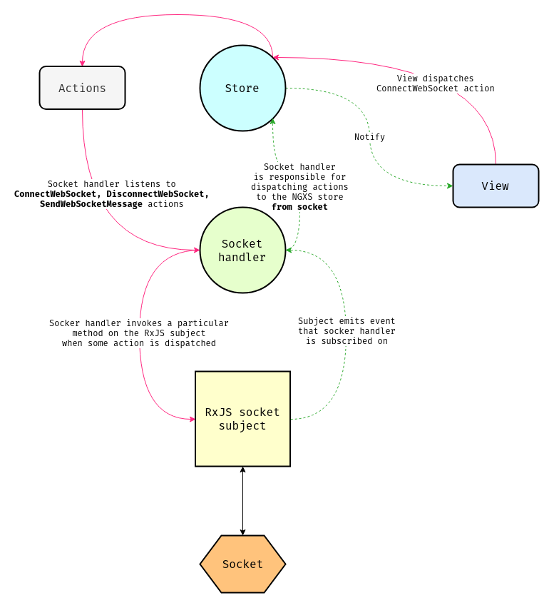

# WebSocket Plugin - Experimental Status
Bind server web socket events to Ngxs store actions.

## Installation
```bash
npm install @ngxs/websocket-plugin --save

# or if you are using yarn
yarn add @ngxs/websocket-plugin
```

## Configuration
Add the `NgxsWebsocketPluginModule` plugin to your root app module:

```TS
import { NgxsModule } from '@ngxs/store';
import { NgxsWebsocketPluginModule } from '@ngxs/websocket-plugin';

@NgModule({
  imports: [
    NgxsModule.forRoot([]),
    NgxsWebsocketPluginModule.forRoot({
      url: 'ws://localhost:4200'
    })
  ]
})
export class AppModule {}
```

The plugin has a variety of options that can be passed:

- `url`: Url of the web socket connection. Can be passed here or by the `ConnectWebsocket` action.
- `typeKey`: Object property that maps the web socket message to a action type. Default: `type`
- `serializer`: Serializer used before sending objects to the web socket. Default: `JSON.stringify`
- `deserializer`: Deserializer used for messages arriving from the web socket. Default: `JSON.parse`

## Usage
Once connected, any message that comes across the web socket will be bound to the state event stream.

Let's assume that a server side web socket sends a message to the client in the following format:

```json
{
  "type": "[Chat] Add message",
  "from": "Artur",
  "message": "Hello NGXS"
}
```

We will want to make an action that corresponds to this web socket message, that will
look like:

```TS
export class AddMessage {
  static type = '[Chat] Add message';
  constructor(public from: string, public message: string) {}
}
```

Assume we've got some `messages` state where we store our chat messages:

```TS
export interface Message {
  from: string;
  message: string;
}

@State<Message[]>({
  name: 'messages',
  defaults: []
})
export class MessagesState {
  @Action(AddMessage)
  addMessage(ctx: StateContext<Message[]>, { from, message }: AddMessage) {
    const state = ctx.getState();
    // omit `type` property that server socket sends
    ctx.setState([...state, { from, message }]);
  }
}
```

We are able to send messages to the server by dispatching the `SendWebSocketMessage` with
the payload that you want to send to the server. Let's try it out:

```TS
@Component({ ... })
export class AppComponent {

  constructor(private store: Store) {}

  sendMessage(from: string, message: string) {
    const event = new SendWebSocketMessage({
      type: 'message',
      from,
      message
    });

    this.store.dispatch(event);
  }

}
```

When sending the message, remember the send is accepting a JSON-able object. The socket on the server side would be listening for the `message` event. For example, the server code could be as follows:

```TS
const { Server } = require('ws');
const { createServer } = require('http');

const app = require('express')();

const server = createServer(app);
const ws = new Server({ server });

server.listen(4200);

ws.on('connection', (socket) => {
  socket.on('message', (data) => {
    // That's the object that we passed into `SendWebSocketMessage` constructor
    const { type, from, message } = JSON.parse(data);

    if (type === 'message') {
      const event = JSON.stringify({
        type: '[Chat] Add message',
        from,
        message
      });

      // That's the same as `broadcast`
      // we want to send message to all connected
      // to the chat clients
      ws.clients.forEach((client) => {
        client.send(event);
      });
    }
  });
});
```

Notice that you have to specify `type` property on server side, otherwise you will get an error - `Type ... not found on message`. If you don't want to use a property called `type` as the key then you can specify your own property name when calling `forRoot`:

```TS
NgxsWebsocketPluginModule.forRoot({
  url: 'ws://localhost:4200',
  typeKey: 'myAwesomeTypeKey'
})
```

In order to kick off our websockets we have to dispatch the `ConnectWebSocket`
action. This will typically happen at startup or if you need to authenticate
before, after authentication is done. You can optionally pass the URL here.

```TS
@Component({ ... })
export class AppComponent {

  constructor(private store: Store) {}

  ngOnInit() {
    this.store.dispatch(new ConnectWebSocket());
  }

}
```

If you have difficulties with understanding how the plugin works, you can have a look at the data flow diagram below. From one side it seems a little bit complex, but no worries. Just follow the pink data flow that leads to the server-side starting from view:



Here is a list of all the available actions you have:

- `ConnectWebSocket`: Dispatch this action when you want to init the web socket. Optionally pass URL here.
- `DisconnectWebSocket`: Dispatch this Action to disconnect a websockets.
- `WebSocketDisconnected`: Action dispatched when web socket is disconnected. Use its handler for reconnecting.
- `SendWebSocketMessage`: Send a message to the server.
- `WebsocketMessageError`: Action dispatched by this plugin when an error ocurrs upon receiving a message.
- `WebSocketConnectionUpdated`: Action dispatched by this plugin when a new connection is created on top of an existing one. Existing connection is closing.

In summary - your server-side sockets should send objects that have a `type` property (or another key that you can provide in the `typeKey` property when calling `forRoot`). This plugin will receive a message from the server and dispatch the message as an action with the corresponding `type` value. If the `type` property doesn't match any client-side `@Action` methods (with an Action with the corresponding `static type` property value) then no State will respond to the message.
